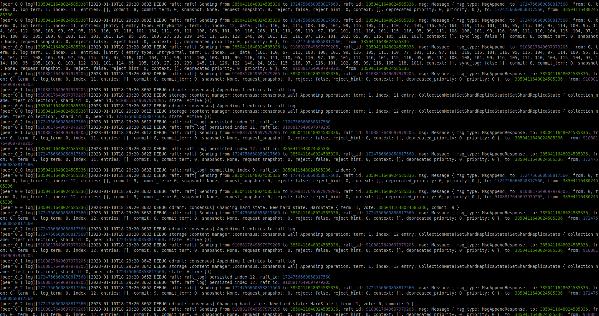

# logs-narrator

Merge log files according to the timestamps to display the logs in a chronological order.

Alternative to [lnav](https://github.com/tstack/lnav) where an additional host id can be extracted via a regex for logs correlation.




## Disclaimer

This tool has not been tested outside my personal use case and is absolutely **NOT** production ready!

Feel free to open an issue if you encounter any problem.

## Usage

```commandline
Options:
  -p, --path <PATH>
          Path to the log files
      --id-detection-regex <ID_DETECTION_REGEX>
          Regex to extract an identifier to color logs [default: "(?:newRaft, raft_id: )(\\d+)"]
      --no-color
          Whether to color the output
      --date-format <DATE_FORMAT>
          Date format to use [default: %Y-%m-%dT%H:%M:%S%.6f%Z]
  -h, --help
          Print help
  -V, --version
          Print version
```

## Installation

### Releases

Using the provided binaries in https://github.com/agourlay/logs-narrator/releases

### Crates.io

Using Cargo via [crates.io](https://crates.io/crates/logs-narrator).

```bash
cargo install logs-narrator
```