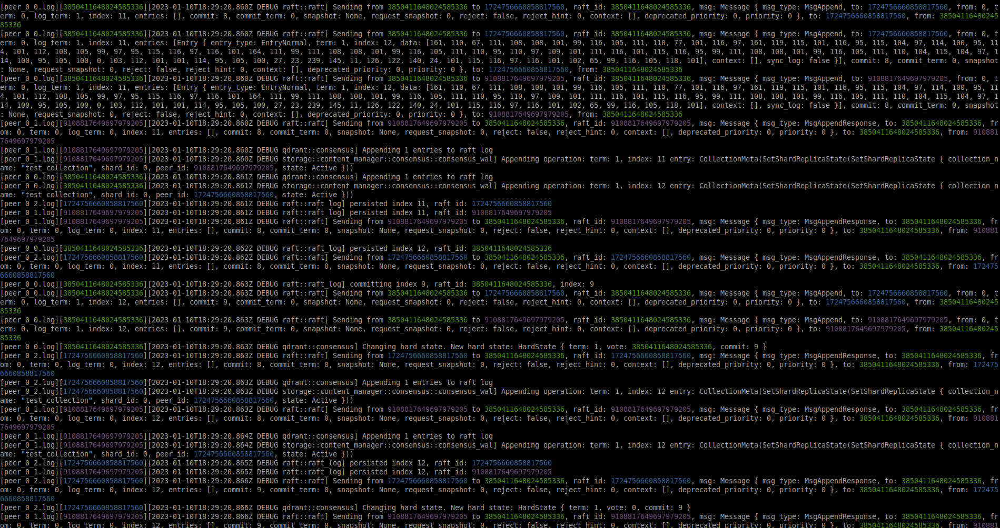

# logs-narrator

Merge log files according to the timestamps to display the logs in a chronological order.

Alternative to [lnav](https://github.com/tstack/lnav) where an additional host id can be extracted via a regex for logs correlation.




## Disclaimer

This tool has not been tested outside my personal use case and is absolutely **NOT** production ready!

Feel free to open an issue if you encounter any problem.

## Usage

```commandline
Merge logs to tell a story

Usage: logs-narrator [OPTIONS] --path <PATH>

Options:
  -p, --path <PATH>
          Path to the directory holding the '.log' files
      --id-detection-regex <ID_DETECTION_REGEX>
          Regex to extract an identifier to color logs, the identifier being the
          first capture group. Pass an empty string to disable identifier
          detection [default: "(?:newRaft, raft_id: )(\\d+)"]
      --no-color
          Disable colored output
      --date-format <DATE_FORMAT>
          Date format of the timestamp starting each log line. Formats without a
          UTC offset are assumed to be UTC [default: %Y-%m-%dT%H:%M:%S%.6f%Z]
  -h, --help
          Print help
  -V, --version
          Print version
```

The merged logs are written to `stdout`, everything else (progress and warnings) to
`stderr`, so the output can safely be piped or redirected. Colors are disabled
automatically when `stdout` is not a terminal.

Each line of a `.log` file is expected to start with a timestamp matching
`--date-format`. Files are sorted individually before being merged, so logs written
by several threads racing between stamping and writing still come out in order. Lines
without one - stack traces, wrapped messages - are attached to the line above them,
and those preceding the first timestamp of a file - banners, startup crashes - open
that file's earliest entry. No timestamp is ever invented for them, so they stay
glued to the entry they belong to instead of drifting through the merge. Blank
lines are dropped.


## Installation

### Releases

Using the provided binaries in https://github.com/agourlay/logs-narrator/releases

### Crates.io

Using Cargo via [crates.io](https://crates.io/crates/logs-narrator).

```bash
cargo install logs-narrator
```